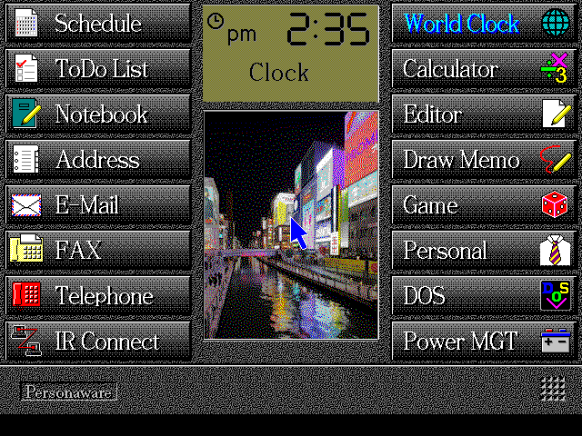
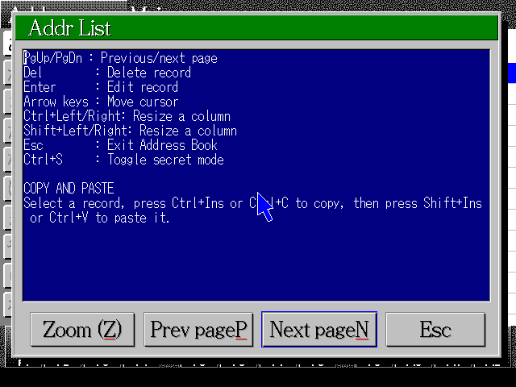
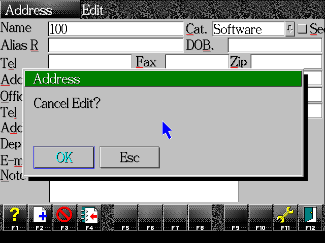
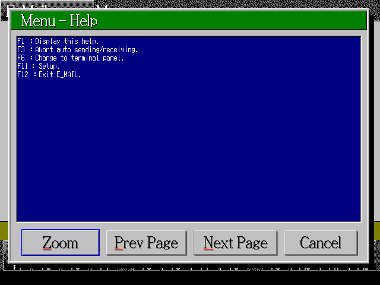
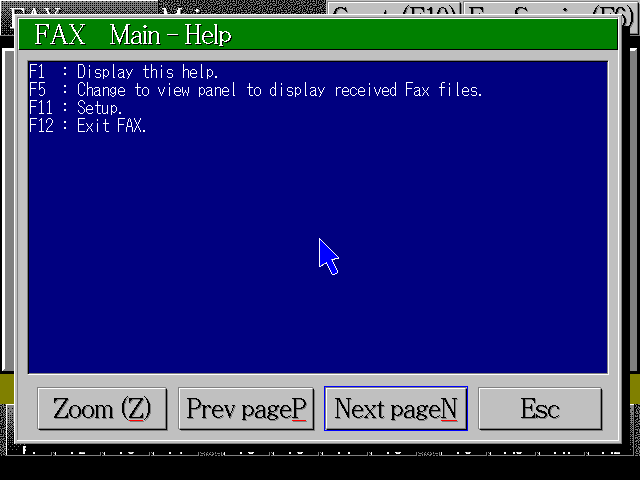
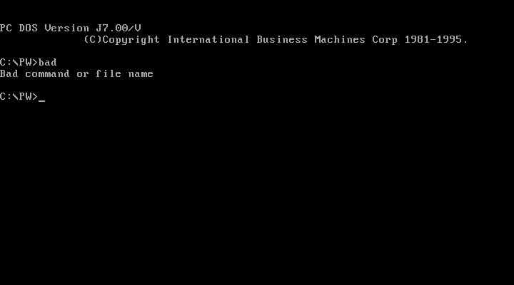
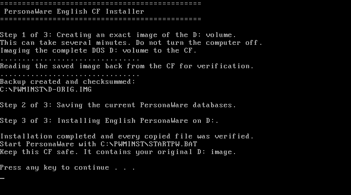
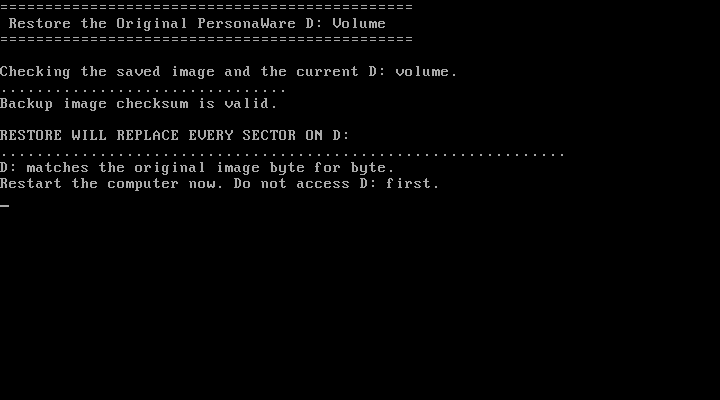

<div align="center">
  
  <h1>PersonaWare English</h1>
  <p><strong>A comprehensive English translation of PersonaWare for the IBM Palm Top PC 110.</strong></p>
  <p>
    
    <a href="https://github.com/ahmadexp/PersonaWare-English/actions/workflows/verify.yml"></a>
    
    
    
    
  </p>
</div>

PersonaWare English replaces the Japanese application interface, warnings,
help panels, launcher metadata, bundled data, and active DOS environment with
concise English text while preserving the original software layout and PC 110
hardware behavior.

## Get the image

| Item | Value |
| --- | --- |
| Bootable image | [`dist/Personaware-English.img`](dist/Personaware-English.img) |
| DOS CF installer | [`dist/PersonaWare-English-CF-Installer.zip`](dist/PersonaWare-English-CF-Installer.zip) |
| Format | 4 MiB raw MBR disk image with an active FAT partition |
| Boot environment | PC DOS 7, U.S. English code page 437 |
| Keyboard | Original PC 110 Japanese keyboard mapping |

SHA-256 checksums:

```text
8bbec705277f2da369875a4c10edbb668f5245a3bbac32c3d7a20147e17dd4f8  Personaware-English.img
6888272e7ecdb42dd0cdbfaca4f36066ce737f1ceecdf140b249507d69cbb3a3  PersonaWare-English-CF-Installer.zip
```

Verify the download before booting:

```sh
cd dist
shasum -a 256 -c SHA256SUMS.txt
```

Boot a copy of the image on an IBM PC 110 or a compatible emulator. The final
runtime pass was performed with the
[`pc110-qemu`](https://github.com/ahmadexp/pc110-qemu) environment in snapshot
mode.

## Install from a bootable DOS CF

Unzip `PersonaWare-English-CF-Installer.zip` onto the root of a DOS-bootable
CF so it creates `C:\PWMINST`. Boot from the CF, confirm that the existing
PersonaWare installation is `D:\PW`, then run:

```bat
C:\PWMINST\INSTALL.BAT
```

Before changing `D:`, the installer saves every sector of the logical `D:`
volume to `C:\PWMINST\D-ORIG.IMG`, creates a size, volume-identity, and CRC-32
sidecar, then reopens and reads the entire image back from the CF. It refuses
to overwrite an existing recovery image. Each payload CRC is checked before
copying, and every installed file is then read back and compared. It also
preserves the four current PersonaWare databases in `C:\PWMINST\USERDATA` and
can safely resume an interrupted installation from a verified image.

To restore the complete original `D:` volume, boot from the same CF and run:

```bat
C:\PWMINST\RESTORE.BAT
```

Recovery verifies the image, matches the target volume size and serial, and
requires typed `YES` confirmation. After writing, it reads all of `D:` back and
checks the complete CRC-32. The volume boot sector is written last, and the
batch file locks further DOS access until restart. If the boot sector is
already unreadable, `FORCERST.BAT` provides a separate emergency path requiring
typed `FORCE` confirmation. Emergency recovery requires the intended volume to
remain assigned as DOS `D:`. The image covers the logical DOS volume, not the
physical disk MBR or partition table.

The archive does not include DOS. Use reliable power, and provide free CF space
equal to the size of `D:` plus at least 3 MiB. The target must be FAT12 or
FAT16, use 512-byte sectors, contain at most 65,535 sectors, and run on a
386-or-newer processor. See the
[complete CF installation and recovery guide](docs/cf-installer.md) before
using it on hardware.

## Screenshots

<table>
  <tr>
    <td width="50%" align="center">
      <br>
      <sub>English application launcher</sub>
    </td>
    <td width="50%" align="center">
      <br>
      <sub>Address Book help and keyboard reference</sub>
    </td>
  </tr>
  <tr>
    <td width="50%" align="center">
      <br>
      <sub>Translated warning and confirmation dialog</sub>
    </td>
    <td width="50%" align="center">
      <br>
      <sub>E-Mail help</sub>
    </td>
  </tr>
  <tr>
    <td width="50%" align="center">
      <br>
      <sub>FAX help</sub>
    </td>
    <td width="50%" align="center">
      <br>
      <sub>English DOS shell and command errors</sub>
    </td>
  </tr>
</table>

<table>
  <tr>
    <td width="50%" align="center">
      <br>
      <sub>Backup-first English installation from the DOS CF</sub>
    </td>
    <td width="50%" align="center">
      <br>
      <sub>Checksummed sector restore with full read-back verification</sub>
    </td>
  </tr>
</table>

## What was translated

### Applications

- Address Book, Schedule, ToDo, Notebook, Editor, E-Mail, FAX, and the FAX
  viewer.
- Shared file dialogs, buttons, warnings, device errors, print errors, search,
  passwords, secret mode, and clipboard operations.
- Previously untranslated F1 help pages and late-path confirmation dialogs.
- Launcher titles, application metadata, and DOS PM command-line messages.

### Bundled data

- Default Notebook and Address Book content, sample game scores, holidays, era
  names, communications defaults, and editor help.
- All 326 World Clock city names.
- All 140 historical dial-directory location labels.

### Boot environment

- Active PC DOS locale changed from Japanese CP932 to U.S. English CP437.
- Japanese IME startup disabled.
- DOS/V input-status text, word-registration prompts, and related warnings
  translated.
- PC 110 keyboard mapping retained.

The Japanese-only postal lookup database was removed. Address Book remains
usable through manual postal and address entry, and its help explains the
change.

## Verification

The release image passed structural, static, and runtime checks:

- Confirmed as a 4 MiB MBR image with its original active FAT partition.
- Extracted every replaced file from the finished image and compared it with
  the translated source.
- Decompressed all 20 PKLITE-compressed PersonaWare modules and confirmed them
  as valid DOS executables.
- Audited translated data and scoped display-string regions for remaining
  Japanese UI text.
- Booted to the launcher and exercised Address Book warnings and help, E-Mail
  help and setup, FAX help, the DOS launcher, and an English command error.
- Rebuilt and tested the DOS CF installer, recovery image metadata, backup-first
  ordering, verified resume, payload CRCs, complete image read-back, target
  identity checks, boot-sector-last restore, emergency recovery, and the
  interrupted-install recovery path.

The automated repository check verifies the image checksum, compiles every
Python utility, validates the translation table, and confirms the release
artifact's size and MBR signature.

## Translation approach

PersonaWare stores CP932 strings inside fixed-layout DOS executables and data
files. The patcher replaces display text within the original byte slots so code,
relocations, and file offsets stay intact. Data rebuilders translate structured
resources separately, and the audit utility scans printable CP932 runs for
likely user-facing Japanese.

Internal CP932 conversion tables and the Address Book kana/romanization lookup
table are intentionally preserved because they implement text conversion and
name lookup rather than visible UI. IBM PC DOS files also retain dormant
Japanese resource copies, but the active boot locale selects their English
resources.

## Repository layout

```text
dist/                         Bootable image, CF installer, and SHA-256 manifest
docs/images/                  Runtime screenshots from the finished build
installer/dos/                16-bit backup, restore, and verified-copy sources
resources/name-translations.tsv
                              Reviewed city and dial-directory names
scripts/audit_japanese.py     CP932-aware Japanese text scanner
scripts/build_cf_installer.py Deterministic DOS CF package builder
scripts/patch_binaries.py     Fixed-slot executable translations
scripts/patch_boot.py         English locale and DOS/V startup patches
scripts/patch_data.py         Data, help, and launcher translations
tests/                        Installer packaging and recovery-safety tests
```

The patch scripts expect legally obtained source files from the original media
and, for the executable pass, the historical partially translated modules.
They deliberately fail when expected bytes differ so an incompatible source
cannot be patched silently.

## Contributing

Bug reports, clearer wording, and additional runtime verification are welcome.
See [`CONTRIBUTING.md`](CONTRIBUTING.md) before submitting source material or
binary artifacts.

## Legal

Project-authored scripts and documentation are available under the
[`LICENSE`](LICENSE). The disk image and its IBM software are not relicensed by
this project. Read [`NOTICE.md`](NOTICE.md) and use or redistribute the image
only when you have the necessary rights to the underlying software and media.
